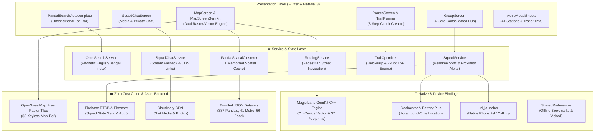

<div align="center">

# 🪔 UMA · উমা
### *কলকাতা দুর্গাপূজা পরিক্রমা, মেট্রো ট্রানজিট ও লাইভ স্কোয়াড কম্প্যানিয়ন*
#### **Kolkata Durga Puja 2026 · Pandal Hopping, Metro Navigation & Live Squad Hub**

<br/>

[](https://flutter.dev)
[](https://dart.dev)
[](https://android.com)
[](https://www.magiclane.com)
[](https://github.com)
[](https://dart.dev)
[](https://cloud.google.com)
[](./LICENSE)

<br/>

**The quintessential, high-performance companion engineered for the world's largest open-air art festival.**  
*387 Verified Pandals · 41 Kolkata Metro Stations · 66 Curated Food Spots · Real Road-Following Pedestrian Routing · Held-Karp Circuit Optimizer · 4-Card Squad Hub · One-Tap Native Calling · In-App Squad Chat & Media · 1-Touch Emergency Lifelines · Zero-Battery-Drain Architecture*

---

**[✨ Key Highlights](#-key-project-highlights) • [🗺️ Dual Map Engine](#️-1-interactive-dual-map-engine) • [🚶 Pedestrian Routing & TSP](#-2-real-road-following-pedestrian-routing--tsp-optimizer) • [👥 Squad Hub & Calling](#-3-consolidated-4-card-squad-hub--native-calling) • [💬 Squad Chat](#-4-dedicated-squad-chat--media-sharing) • [🚇 Metro Network](#-5-integrated-kolkata-metro-transit-network) • [🍲 Heritage Food](#-6-curated-culinary--street-food-guide) • [🚨 Emergency Safety](#-7-emergency-lifelines--festival-safety) • [🏛️ System Architecture](#️-system-architecture) • [🚀 Getting Started](#-getting-started--developer-guide)**

---

</div>

<br/>

> [!NOTE]  
> **Target Launch:** Google Play Store deployment in time for **Durga Puja 2026** (*Mahalaya: October 10, 2026 · Maha Shasthi: October 16, 2026 · Dashami: October 20, 2026*).  
> **Core Tenet:** **100% Free Tiers ($0 Operating Cost)**, keyless OpenStreetMap raster tiles, on-device Magic Lane GemKit vector maps, zero vendor lock-in, foreground-only privacy protection, and complete offline autonomy.

<br/>

---

## 📊 Live Project Metrics Dashboard

| Metric | Status | Technical Details & Highlights |
|:---|:---:|:---|
| 🛕 **Curated Pandals** | **387 Verified Pandals** | 100% authentic, de-duplicated database spanning all 8 zones with geo-coordinates, historical themes, timings, ratings, and nearest metro distance. |
| ⚡ **Rendering Engine** | **60 / 120 FPS Locked** | Sub-millisecond memoized L1 spatial clustering cache, directional 35% margin viewport culling, GPU `RepaintBoundary` isolation. |
| 🚇 **Kolkata Metro Network** | **41 Stations (4 Lines)** | Blue (North-South), Green (East-West / Underwater Hooghly tunnel), Purple (Joka-Majerhat), and Orange (Kavi Subhash-Ruby) corridors. |
| 🍲 **Heritage Food & Cabins** | **66 Curated Spots** | Century-old sweet shops, British-era heritage cabins, legendary Mughlai institutions, street food hubs, and community puja bhog spots. |
| 🔍 **Universal Omni-Search** | **Unconditional Top Bar** | Permanent floating search HUD with frosted-glass acrylic blur (`BackdropFilter`), phonetic English/Bengali matching, and instant auto-centering. |
| 🚶 **Pedestrian Road Routing** | **Real Street Geometry** | True turn-by-turn road networks calculated via on-device GemKit (`RouteTransportMode.pedestrian`); two-segment styling (muted approach + radiant gold trail). |
| 🧭 **Circuit TSP Optimizer** | **Held-Karp & 2-Opt** | Mathematically optimal walking sequences: exact Held-Karp dynamic programming for $N \le 12$ and 2-opt iterative improvement for $N > 12$. |
| 👥 **Consolidated Squad Hub** | **4-Card Unified Hub** | Squad overview with 6-character code, destination pin & configurable separation alerts (250m/500m/1000m), companion list, and **One-Tap Phone Dialing (`tel:`)**. |
| 💬 **Private Squad Chat** | **Real-Time Stream** | Dedicated in-app group messaging, photo & video media attachments via Cloudinary CDN, and seamless in-memory fallback for offline/demo mode. |
| 🔗 **Universal Deep Links** | **App Links & Schemes** | Custom schemes (`pujoparikrama://join`, `pujo://join`) & HTTPS App Links (`sharodiya.com/join`, `/pandal/`) with instant invite handling. |
| 🎨 **Divine Visual Identity** | **Festive Material 3** | Animated *Chokkhu Daan* eye-opening welcome splash, OLED night surface (`#0E0B0C`), Crimson Velvet (`#800020`), and Festival Gold (`#FFD700`). |
| 🚨 **Emergency Lifelines** | **1-Touch Calling** | One-tap native dialer integration for Kolkata Police (100), Ambulance (102), Fire (101), Women Helpline (1091), Traffic, and Disaster Control. |
| 🧪 **Test & Code Health** | **143 / 143 Passing** | Static analysis: **0 warnings / 0 errors**, 143 automated unit, widget, and integration test assertions across 32 comprehensive suites. |

<br/>

---

## ✨ Key Project Highlights

```
                                      ┌──────────────────────────────────────┐
                                      │        UMA · কলকাতা পূজা ২০২৬        │
                                      └──────────────────┬───────────────────┘
                                                         │
         ┌───────────────────────┬───────────────────────┼───────────────────────┬───────────────────────┐
         │                       │                       │                       │                       │
 🗺️ Dual Map Engine      🔍 Universal Omni-Search 🚶 Road Routing & TSP   👥 4-Card Squad Hub     🚨 Helplines & Safety
 • OSM Free Raster       • Unconditional HUD     • Real Street Paths     • Live Companion GPS    • 1-Tap Direct Call
 • GemKit 3D Vector      • In-Layout Banners     • Two-Segment Styling   • 250m/500m/1km Alerts  • Kolkata Police (100)
 • 387 Verified Pandals  • Phonetic Matching     • Held-Karp Optimizer   • 1-Tap Native Calling  • Ambulance & Fire
 • 41 Metro Stations     • Auto-Unmounting Chips • Unified Time/Distance • Squad Chat & Media    • Offline Protocols
```

<br/>

---

## 🌟 Feature Showcase

### 🗺️ 1. Interactive Dual Map Engine
* **Dual Rendering Architecture:** 
  * **Free-Tier OpenStreetMap Raster Engine:** Powered by `flutter_map` with lightweight caching, zero billing risk, and 100% free operation.
  * **Native GemKit 3D Vector Engine:** High-performance on-device C++ vector mapping by Magic Lane featuring 3D extruded architectural footprints, dynamic elevation, and pitch/rotation gestures.
* **387 Authentic Curated Pandals:** Mapped with sub-meter geo-coordinates across 8 distinct regional circuits.
* **Permanent Unconditional Search Bar:** The floating top search HUD stays pinned to the screen at all times—never hidden during map pans, route previews, or layer toggles.
* **In-Layout Contextual Banner:** Clean informational banners (*"Showing 41 Kolkata Metro stations"*, *"Filtered to North Kolkata Heritage Trail"*) render inside the normal widget hierarchy below filter chips, completely eliminating floating `Overlay` collisions over the App Bar.
* **Smart Filter Chip Auto-Unmounting:** Tapping or focusing the search bar instantly and smoothly collapses filter chips, giving autocomplete recommendations 100% unhindered vertical space.
* **Fast Regional Auto-Fly:** One-touch smooth camera transitions to North Kolkata, South Kolkata, Salt Lake, New Town, Central, Howrah, Kalyani, and Hooghly.

```
┌─────────────────────────────────────────────────────────────────┐
│  🔍  Search 387 pandals, 41 metro stations, 66 food spots...    │  ◄── Unconditional Top Bar
└─────────────────────────────────────────────────────────────────┘
 [ 🛕 All Pandals (387) ] [ 🚇 Metro Lines ] [ 🍲 Food Spots ] [ 👥 Squad (3) ] ◄── Filter Row
 ┌───────────────────────────────────────────────────────────────┐
 │ ℹ️ Showing all 41 Kolkata Metro stations with walking routes    │  ◄── In-Layout Banner
 └───────────────────────────────────────────────────────────────┘
```

<br/>

### 🔍 2. Universal Omni-Search
* **Multi-Entity Unified Index:** Seamlessly searches across **387 pandals**, **41 metro stations**, and **66 food spots** simultaneously.
* **Phonetic & Bilingual Transliteration:** Intelligently matches phonetic variations across English and Bengali scripts (e.g., *Shobhabazar*, *Sovabazar*, *Sobhabazar*, *শোভাবাজার*).
* **Frosted-Glass Acrylic HUD:** Built with real-time `BackdropFilter` gaussian blur, typography contrast optimization, and instant keyboard focus.
* **Substring Highlighting & Proximity Badges:** Matching characters are highlighted with distinct golden accents alongside live Haversine distance calculations from the user's current GPS location.
* **Persistent Search Bar After Selection:** Selecting any suggestion centers the map and displays the location sheet while keeping the search bar interactive for immediate subsequent queries.

<br/>

### 🚶 3. Real Road-Following Pedestrian Routing & TSP Optimizer
* **True Street Network Geometry:** Unlike standard apps that draw straight lines over barricaded Kolkata streets, Uma calculates realistic pedestrian paths following pedestrian lanes, alleys, and thoroughfares via GemKit's on-device `RoutingService.calculateRoute()` (`RouteTransportMode.pedestrian`).
* **Two-Segment Visual Route Hierarchy:**
  * **"Getting There" Segment (`bMainRoute: false`):** Rendered as a subtle, muted secondary corridor from the user's current position to the trail start point.
  * **"Your Trail" Segment (`bMainRoute: true`):** Highlighted with bold, radiant gold illumination connecting the sequenced pandal nodes.
* **Unified Single Source of Truth:** Route summary banners, floating trip HUDs, and step navigation cards derive their metrics directly from `route.getTimeDistance()` (`totalDistanceM` and `totalTimeS`).
* **Held-Karp Dynamic Programming ($N \le 12$):** Solves the Traveling Salesperson Problem to mathematical optimality ($O(N^2 2^N)$) for custom trails up to 12 pandals.
* **2-Opt Heuristic ($N > 12$):** Iteratively eliminates intersecting paths for expansive city-wide circuits.
* **Cross-Engine Polyline Sync:** Computed street paths synchronize seamlessly to the 2D raster fallback map via `ActiveCustomTrail.routedPolyline`.

```
 User Location (GPS)
       │
       ┊ (Muted Approach Route - "Getting there")
       ▼
 [ 🛕 Start: Bagbazar Sarbojanin ]
       │
       ├──► [ 🛕 Kumartuli Park ] ──► [ 🛕 Ahiritola ] ──► [ 🛕 Sovabazar Rajbari ]
       │     (Real Road Geometry via GemKit Pedestrian Network)
       ▼
 [ ⭐ Route Completed · Total Time & Distance via route.getTimeDistance() ]
```

<br/>

### 👥 4. Consolidated 4-Card Squad Hub & Native Calling
* **Unified 4-Card Screen Layout:** Streamlined from fragmented dialogs into four clear, intuitive functional cards:
  1. **🏷️ Squad Overview Card:** Displays the squad moniker (with auto-sanitized apostrophe formatting, e.g., `Arnab,s` $\to$ `Arnab's`), the unique 6-character alphanumeric invite code, and 1-tap copy/share link actions.
  2. **📍 Target Destination & Separation Alerts:** Live meetup pin with instant configurable separation threshold buttons (**250m**, **500m**, **1000m**); dispatches real-time proximity alerts if a companion drifts away in crowd congestion.
  3. **👥 Companions Directory:** Live member cards featuring initials avatars, battery percentage gauges, real-time distance from user, **"Locate on Map" camera focus**, and **One-Tap Phone Dialing (`tel:`)** using linked companion phone numbers.
  4. **💬 Squad Chat & Media Hub:** Compact direct-access card displaying unread message counters and the latest message snippet.
* **Universal Deep Link Integration:**
  * Custom URI Schemes: `pujoparikrama://join?code=PUJAX4K9` & `pujo://join/PUJAX4K9`
  * HTTPS Universal Links: `https://sharodiya.com/join?code=PUJAX4K9` & `https://kolkata-puja-2026.web.app/join`
  * Direct Pandal Deep Links: `https://sharodiya.com/pandal/bagbazar_sarbojanin`

<br/>

### 💬 5. Dedicated Squad Chat & Media Sharing
* **In-App Private Messaging (`SquadChatScreen`):** Low-latency, end-to-end squad group chat running on real-time stream subscription.
* **Festival Media Sharing:** Capture and broadcast pandal photos, idol close-ups, and short festival video clips directly into the squad timeline with secure Cloudinary CDN URLs.
* **Autonomous In-Memory Fallback:** When running in demo mode or in low-connectivity areas before Firebase is linked, `SquadChatService` operates an in-memory broadcast stream, ensuring the UI remains 100% interactive and crash-proof.

<br/>

### 🚇 6. Integrated Kolkata Metro Transit Network
* **Comprehensive 41-Station Coverage:** Complete operational and extended transit corridors across the city:
  * 🔵 **Line 1 (Blue Line — North-South):** Dakshineswar ↔ Dum Dum ↔ Esplanade ↔ Kalighat ↔ Kavi Subhash (32 km).
  * 🟢 **Line 2 (Green Line — East-West / Underwater):** Howrah Maidan ↔ Esplanade (under the Hooghly river) & Sealdah ↔ Salt Lake Sector V.
  * 🟣 **Line 3 (Purple Line):** Joka ↔ Behala ↔ Majerhat / Taratala.
  * 🟠 **Line 6 (Orange Line):** Kavi Subhash (New Garia) ↔ Hemanta Mukhopadhyay (Ruby Crossing).
* **Interactive Metro Station Sheets:** Tap any station pin on the map to inspect its corridor line, interchange status, first/last train timings, and walking directions to famous surrounding pandals.

<br/>

### 🍲 7. Curated Culinary & Street Food Guide
* **66 Hand-Picked Landmarks:** An authentic culinary catalog designed for night-long pandal hopping:
  * 🍮 **Legendary Sweet Shops:** K.C. Das (Esplanade), Balaram Mullick & Radharaman Mullick (Bhawanipore), Girish Chandra Dey & Nakur Chandra Nandy (Hatibagan), Chittaranjan German (Shobhabazar).
  * ☕ **Heritage British-Era Cabins:** Mitra Cafe (Shobhabazar), Allen Kitchen (Shobhabazar), Dilkhusha Cabin (College Street), Basanta Cabin.
  * 🍗 **Iconic Mughlai Delicacies:** Arsalan (Park Circus), Shiraz Golden Restaurant (Mullick Bazar), Aminia, Royal Indian Hotel (Chitpur).
  * 🥟 **Street Food Hubs:** Dacre Lane (Esplanade), Vivekananda Park phuchka stalls, Vardaan Market chaat counters.
  * 🍚 **Community Puja Bhog:** Designated authentic bhog distribution centers with prayer schedules.
* **Isolated Bookmarking:** Food spot favorites are stored in a dedicated preference store (`food_favorites`), preventing contamination of pandal checklists.

<br/>

### 🚨 8. Emergency Lifelines & Festival Safety
* **1-Touch Native Emergency Calling:** Instant phone dialer launch via `url_launcher` for Kolkata's essential public safety services:
  * 🚓 **Kolkata Police Control Room:** `100` / `033-2214-3230`
  * 🚑 **Ambulance Services:** `102`
  * 🚒 **Fire & Emergency Services:** `101`
  * 🛡️ **Women Helpline:** `1091` / `1090`
  * 🚦 **Kolkata Traffic Police Help:** `1073` / `033-2214-3644`
  * 🆘 **State Disaster Management:** `1070`
  * 👶 **Childline National Helpline:** `1098`
* **Crowd Safety Advisories:** Guidelines for crowd surge management, lost companion assembly points, first-aid booth markers, and electrical safety around illuminated arches.

<br/>

### 🪔 9. Divine Welcome Experience & Festive Aesthetics
* **Animated Chokkhu Daan Welcome (`WelcomeScreen`):** Cultural onboarding experience featuring the divine third eye and visage of Maa Durga drawn with an animated stroke-formation effect.
* **Ambient Breathing Pupil Glow:** Subtle, organic luminescence on pure dark OLED background.
* **Durga Puja 2026 Countdown Capsule:** Real-time countdown clock ticking down to Mahalaya (Oct 10, 2026) and Maha Shasthi (Oct 16, 2026).
* **Festive Material 3 Theme Palette:**
  * 🔴 **Crimson Velvet (`0xFF800020`):** Inspired by sacred altar *sindoor* and devotional drapery.
  * 🟡 **Festival Gold (`0xFFFFD700`):** Reflecting the radiant illumination of *Chandi* ornaments and pandal chandeliers.
  * ⚫ **Night Surface (`0xFF0E0B0C`):** True-black OLED dark mode engineered for minimal battery consumption during overnight pandal hopping.

<br/>

---

## 📍 Regional Coverage Master Table

| Zone Code | English Label | Bengali Label | Pandals | Renowned Flagship Pandals |
|---|---|---|:---:|---|
| `southKolkata` | **South Kolkata** | দক্ষিণ কলকাতা | **170** | Ekdalia Evergreen, Tridhara Sammilani, Suruchi Sangha, Deshapriya Park, Chetla Agrani, Mudiali Club, Singhi Park, Ballygunge Cultural |
| `northKolkata` | **North Kolkata** | উত্তর কলকাতা | **129** | Bagbazar Sarbojanin, Kumartuli Park, Hatibagan Sarbojanin, Sovabazar Rajbari, Tala Prattoy, Kasi Bose Lane, Ahiritola Sarbojanin |
| `eastKolkata` | **Salt Lake & New Town** | সল্টলেক ও নিউ টাউন | **62** | Sreebhumi Sporting Club, FD Block, BJ Block, AK Block, Labony Estate, New Town Sarbojanin |
| `centralKolkata` | **Central Kolkata** | মধ্য কলকাতা | **11** | College Square, Mohammad Ali Park, Santosh Mitra Square, Bowbazar Sarbojanin |
| `nadiaKalyani` | **Kalyani (Nadia)** | কল্যাণী (নদিয়া) | **6** | ITI More Luminous, Rathtala, Central Park, A9, B-Block, Boat Park |
| `hooghlyChinsurah` | **Chinsurah (Hooghly)** | চুঁচুড়া (হুগলি) | **5** | Panchanantala, Pirtala, Datta Bari (Est. 1862), Chapatala, Sandeswar Tala |
| `howrah` | **Howrah** | হাওড়া | **3** | Howrah Sarbojanin, Salkia, Shibpur heritage pujas |
| `hooghlyBandel` | **Bandel (Hooghly)** | ব্যান্ডেল (হুগলি) | **1** | Keota Nabin Sangha & grand illumination zones |
| **Total** | **All 8 Circuits** | **সর্বমোট** | **387** | **100% Authentic, De-duplicated, Zero Synthetics** |

<br/>

---

## 🏛️ System Architecture



<br/>

---

## 📂 Repository Directory Layout

```
puja_proj/
├── app/                                    # Flutter Native Client Application
│   ├── android/                            # Android native shell & Manifest deep link filters
│   ├── assets/
│   │   ├── data/
│   │   │   ├── pandals.json                # Master verified database of 387 pandals
│   │   │   ├── food_spots.json             # 66 curated eateries, sweet shops & cabins
│   │   │   └── helplines.json              # Emergency services & festival safety protocols
│   │   └── images/
│   │       ├── app_icon.png                # Official Uma launcher icon
│   │       ├── splash_illustration.webp    # 3-Dancer Dhunuchi celebration illustration
│   │       └── login_bg_eyes.webp          # Sacred Maa Durga eyes motif background
│   ├── lib/
│   │   ├── config/                         # Material 3 Crimson & Gold theme tokens
│   │   ├── models/                         # Pandal, MetroStation, FoodSpot, SquadMember, ChatMessage
│   │   ├── repositories/                   # LocalAssetRepository, MetroRepository, SupplementaryRepository
│   │   ├── screens/
│   │   │   ├── map_screen.dart             # OSM raster map with permanent search bar & banner
│   │   │   ├── map_screen_gemkit.dart      # Magic Lane 3D vector map & road pedestrian routing
│   │   │   ├── pandal_list_screen.dart     # Searchable 387 directory with isolated favorites
│   │   │   ├── routes_screen.dart          # 5 Curated circuits & 3-step Custom Trail builder
│   │   │   ├── group_screen.dart           # Consolidated 4-card squad hub & 1-tap dialer
│   │   │   ├── squad_chat_screen.dart      # Private squad group chat & media sharing
│   │   │   ├── helplines_screen.dart       # 1-Touch emergency phone calling & safety tips
│   │   │   ├── welcome_screen.dart         # Divine Maa Durga animated Chokkhu Daan welcome
│   │   │   └── main_navigation_screen.dart # 5-Tab responsive navigation scaffold
│   │   ├── services/
│   │   │   ├── omni_search_service.dart    # Universal multi-entity search with phonetic matching
│   │   │   ├── routing_service.dart        # Calibrated pedestrian routing & dual-mode ETAs
│   │   │   ├── squad_service.dart          # Live companion sync, meetup pins & separation alerts
│   │   │   ├── squad_chat_service.dart     # Real-time squad messaging & fallback broadcast stream
│   │   │   ├── trail_optimizer.dart        # Held-Karp and 2-opt TSP walking path optimizer
│   │   │   ├── custom_hopping_trail_service.dart # Active custom trail & routed metrics
│   │   │   ├── location_service.dart       # GPS positioning & distance formatting
│   │   │   └── auth_service.dart           # Google Sign-In & 1-tap anonymous guest entry
│   │   └── widgets/                        # Autocomplete HUD, custom dialogs, detail modal sheets
│   └── test/                               # 32 Automated test suites (143/143 assertions passing)
├── data/                                   # Source datasets & CSV audit spreadsheets
├── docs/                                   # Technical specs, GemKit integration guides, and reports
├── scripts/
│   ├── scrape_pujoplanner.js               # Autonomous scraper for live pandal metadata
│   └── seed_pandals.js                     # Cloud Firestore data population script
├── AGENTS.md                               # Environment configuration and agent run rules
├── PRIVACY.md                              # Foreground-only location & privacy charter
└── README.md                               # Project showcase and master documentation
```

<br/>

---

## 🚀 Getting Started & Developer Guide

### Prerequisites
* **Flutter SDK:** Version `3.13.0` or higher (`Dart 3.0+`)
* **Android SDK:** Platform `android-36`, Build-Tools `36.0.0`, NDK
* **JDK:** Version 17 (`JAVA_HOME` configured)
* **Node.js:** Version 18+ (required only if running data scraping scripts)

### Installation & Execution

```bash
# 1. Clone the repository
git clone https://github.com/Arnab-apk/Hopping_Guide.git
cd Hopping_Guide/app

# 2. Resync and install Dart dependencies
flutter pub get

# 3. Verify static analysis and code quality (0 issues guaranteed)
flutter analyze

# 4. Execute the comprehensive test suite (143/143 passing)
flutter test

# 5. Launch the app on a connected Android phone or emulator
flutter run

# 6. Build the production release APK
flutter build apk --release
```

<br/>

> [!TIP]  
> **Instant Standalone Demo Mode:**  
> The application is engineered to boot immediately in **Full Demo Mode** without requiring any Firebase configuration. All 387 pandals, 41 metro stations, 66 food spots, spatial clustering, pedestrian routing, offline bookmarks, and in-memory squad chat function out-of-the-box using bundled assets.

<br/>

### Testing Deep Links via ADB

Test squad invitations and direct pandal routing directly from your terminal:

```bash
# Test Custom Scheme Squad Invite
adb shell am start -W -a android.intent.action.VIEW -d "pujoparikrama://join?code=PUJAX4K9"

# Test HTTPS App Link Squad Invite
adb shell am start -W -a android.intent.action.VIEW -d "https://sharodiya.com/join?code=PUJAB9Z2"

# Test Direct Pandal View Deep Link
adb shell am start -W -a android.intent.action.VIEW -d "https://sharodiya.com/pandal/bagbazar_sarbojanin"
```

<br/>

---

## 🔒 Privacy, Security & Power Efficiency

* 🔋 **Zero Background Battery Drain:** Operates strictly using foreground location services (`ACCESS_FINE_LOCATION` and `ACCESS_COARSE_LOCATION`) while the app or active navigation notification is visible. No background location drain.
* 🛡️ **Zero Unnecessary Permissions:** No background location permissions (`ACCESS_BACKGROUND_LOCATION` is explicitly omitted), avoiding Play Store review delays and protecting user trust.
* 🔐 **Credential Protection:** Cloud configuration files (`google-services.json`, `GoogleService-Info.plist`, `firebase_options.dart`) and API keys are untracked in version control.
* 🌐 **Zero Cloud Dependency Lock-in:** The entire core navigation, search, directory, and trail optimization stack operates entirely offline on-device.

<br/>

---

## 🗓️ Release Roadmap

- [x] **Phase 1: Architecture & Design System**
  - Scaffold Flutter project with Material 3 festive tokens (Crimson Velvet `#800020` & Festival Gold `#FFD700`)
  - Build animated *Chokkhu Daan* welcome screen and real-time Durga Puja 2026 countdown clock
- [x] **Phase 2: Master Dataset & Spatial Clustering**
  - Curate and verify **387 authentic pandals** across all 8 zones with 0 synthetic placeholders
  - Engineer `PandalSpatialClusterer` with sub-millisecond L1 memoization cache and 60/120 FPS performance
- [x] **Phase 3: Kolkata Metro Transit Layer**
  - Map **41 Kolkata Metro stations** across Blue, Green (underwater tunnel), Purple, and Orange lines
  - Implement station modal sheets with interchange badges and direct walking distance to nearby pandals
- [x] **Phase 4: Universal Omni-Search & In-Layout Banner**
  - Permanent, unconditionally visible top search bar with frosted-glass acrylic blur
  - Clean in-layout contextual banner below filter chips with zero header overlap
  - Phonetic English/Bengali transliteration and instant map spotlighting
- [x] **Phase 5: Real Road Pedestrian Routing & TSP Circuit Optimizer**
  - Native GemKit pedestrian routing (`RouteTransportMode.pedestrian`) on real street networks
  - Two-segment styling (muted "Getting there" approach + radiant gold "Your trail")
  - Held-Karp dynamic programming ($N \le 12$) and 2-opt heuristic ($N > 12$)
  - Unified single source of truth for duration & distance via `route.getTimeDistance()`
- [x] **Phase 6: Consolidated 4-Card Squad Hub, Calling & Chat**
  - Streamlined 4-card Squad Screen with configurable separation thresholds (250m / 500m / 1000m)
  - Native one-tap phone dialing (`tel:`) for companions
  - Universal deep links (`pujoparikrama://join`, `https://sharodiya.com/join`)
  - Dedicated Squad Chat with real-time stream, Cloudinary media sharing, and offline fallback
- [ ] **Phase 7: Google Play Store Release**
  - Production Firebase project binding and final store assets
  - Public launch for Durga Puja 2026

<br/>

---

## 📜 License & Community

This project is open-source software licensed under the **[MIT License](./LICENSE)**.  
Built with devotion, engineering passion, and ❤️ for the millions of pandal-hoppers and festival-lovers across Bengal.

<br/>

<div align="center">
  <sub>শুভ দুর্গোৎসব ২০২৬ · মায়ের আগমনী সুরে মুখরিত হোক প্রতিটি প্রান্তর 🪔</sub>
</div>
