# 📖 UMA Engineering Documentation Hub
### *Architecture, Feature Specs, Navigation Engines, and Technical Audits*

Welcome to the centralized documentation repository for **UMA (উমা)** — the Kolkata Durga Puja 2026 Pandal Hopping, Metro Transit, and Real-Time Live Squad Companion.

All technical documentation, architectural RFCs, verification checklists, and audit reports are cataloged here in a structured, professional taxonomy.

---

## 🗺️ Documentation Taxonomy & System Map

```mermaid
graph TD
    Root["📚 UMA Documentation Hub (`docs/README.md`)"]
    
    Arch["🏛️ Architecture & System Design (`docs/architecture/`)"]
    Feat["🚀 Features & Capabilities (`docs/features/`)"]
    Maps["🗺️ Navigation & Map Engines (`docs/maps-gemkit/`)"]
    Maint["🛠️ Maintenance, Audits & Debt (`docs/maintenance/`)"]
    Data["📊 Data & Specs (`data/schema/`, `.kiro/specs/`)"]
    
    Root --> Arch
    Root --> Feat
    Root --> Maps
    Root --> Maint
    Root --> Data
    
    Arch --> SysArch["SYSTEM_ARCHITECTURE.md<br/><i>Core Build Plan, Tech Stack & $0 Free Tier</i>"]
    
    Feat --> EnhNav["ENHANCED_FEATURES_IMPLEMENTATION.md<br/><i>12 Live Tracking & Navigation Features</i>"]
    Feat --> ImpComp["IMPLEMENTATION_COMPLETE.md<br/><i>Verification Report & 143/143 Test Specs</i>"]
    Feat --> RailStn["RAILWAY_STATIONS_INTEGRATION.md<br/><i>$0 Railway & Metro Station Transit Network</i>"]
    Feat --> RouteBot["ROUTE_CHATBOT_IMPLEMENTATION.md<br/><i>$0 Grounded Route Assistant Chatbot</i>"]
    
    Maps --> MLGuide["MAGIC_LANE_INTEGRATION.md<br/><i>GemKit C++ 3D Vector Map Engine</i>"]
    Maps --> GKStatus["GEMKIT_INTEGRATION_STATUS.md<br/><i>Plugin Bridge & Asset Milestone Tracker</i>"]
    Maps --> GKQuick["QUICK_START_GEMKIT.md<br/><i>Developer Quick Reference Card</i>"]
    Maps --> GKNext["GEMKIT_NEXT_STEPS.md<br/><i>API Token & Native SDK Roadmap</i>"]
    
    Maint --> CodeReport["CODEBASE_ANALYSIS_REPORT.md<br/><i>Deep Architecture & Gap Audit</i>"]
    Maint --> Fixes["FIXES_APPLIED.md<br/><i>Log of 9 Critical Security & Bug Patches</i>"]
    Maint --> Gaps["KNOWN_GAPS.md<br/><i>Sprint Backlog & Profiling Investigation</i>"]
    
    Data --> PandalSchema["data/schema/README.md<br/><i>Pandal & Event GeoJSON Schema</i>"]
    Data --> WSSpec["WebSocket Squad Migration<br/><i>Realtime Protocol & Channel Specs</i>"]
```

---

## 🧭 Navigation Matrix by Role

Find the documentation most relevant to your workflow:

| Role / Responsibility | Recommended Starting Point | Key References |
|:---|:---|:---|
| **Flutter Mobile Developer** | [🚀 Enhanced Navigation Features](./features/ENHANCED_FEATURES_IMPLEMENTATION.md) | [Architecture Plan](./architecture/SYSTEM_ARCHITECTURE.md) · [App README](../app/README.md) · [Stations Integration](./features/RAILWAY_STATIONS_INTEGRATION.md) |
| **Backend & Realtime Engineer** | [🏛️ System Architecture](./architecture/SYSTEM_ARCHITECTURE.md) | [Server README](../server/README.md) · [WebSocket Specs](../.kiro/specs/websocket-squad-migration/design.md) |
| **GIS & Map Engine Engineer** | [🗺️ Magic Lane GemKit Guide](./maps-gemkit/MAGIC_LANE_INTEGRATION.md) | [GemKit Status](./maps-gemkit/GEMKIT_INTEGRATION_STATUS.md) · [Stations Integration](./features/RAILWAY_STATIONS_INTEGRATION.md) · [Quickstart](./maps-gemkit/QUICK_START_GEMKIT.md) |
| **QA / Test Automation** | [✅ Implementation Verification](./features/IMPLEMENTATION_COMPLETE.md) | [Test Suites](../app/test/) · [Known Gaps](./maintenance/KNOWN_GAPS.md) |
| **Security & DevOps Auditor** | [🛠️ Codebase Analysis Report](./maintenance/CODEBASE_ANALYSIS_REPORT.md) | [Fixes Applied](./maintenance/FIXES_APPLIED.md) · [Privacy Policy](../PRIVACY.md) |

---

## 📂 Document Catalog by Directory

### 🏛️ Architecture & System Design (`docs/architecture/`)
Foundational system designs, infrastructure decisions, cost constraints, and communication patterns.

- **[SYSTEM_ARCHITECTURE.md](./architecture/SYSTEM_ARCHITECTURE.md)**  
  *Core Kolkata Puja App Architecture & Build Plan*  
  - Feature scope prioritization (P0 Launch Blockers, P1 Stretch, P2 Post-Launch).
  - 3-tier tech stack (Flutter, OpenStreetMap / GemKit, Firebase & Custom WebSocket Server).
  - Data pipelines, team workflow, and 100% Free-Tier ($0 operational cost) budget model.
  - Play Store Data Safety, foreground-only location privacy, and permission rationale.

---

### 🚀 Feature Specifications & Live Tracking (`docs/features/`)
In-depth technical guides for navigation, user tracking, companion safety, and test suites.

- **[ENHANCED_FEATURES_IMPLEMENTATION.md](./features/ENHANCED_FEATURES_IMPLEMENTATION.md)**  
  *Google Maps-Level Live Tracking & Navigation Architecture (12/12 Features)*  
  - Real-time turn-by-turn navigation with 5m GPS accuracy and 30m off-route auto-recalculation.
  - Live Tracking Engine (speed in km/h, pace in min/km, dynamic ETA, distance traveled).
  - 5-level Peer-to-Peer Crowd Density Heatmap overlay with radial gradient rendering.
  - Native Smart Notification Service (arrival celebration, separation alert, low battery warning).
  - Enhanced Map Controls (MapTypeSelector with 4 types & 3 overlays, 3-mode MyLocation cycle, LiveRouteProgressHUD).

- **[IMPLEMENTATION_COMPLETE.md](./features/IMPLEMENTATION_COMPLETE.md)**  
  *Feature Verification Report, Automated Test Suite & Launch Checklist*  
  - Full audit of all 12 navigation and tracking features with code references.
  - Automated verification script (`app/test_all_features.sh`).
  - 143/143 automated test assertions breakdown across 32 test suites.
  - Production readiness checklist for Google Play Store release.

- **[RAILWAY_STATIONS_INTEGRATION.md](./features/RAILWAY_STATIONS_INTEGRATION.md)**  
  *Zero-Cost Railway & Kolkata Metro Station Integration*  
  - OpenStreetMap Overpass API & Wikidata CC0 SPARQL pipeline for 206+ stations.
  - Offline GeoJSON bundling (`stations.geojson`) at ~116 KB with zero runtime API cost.
  - Precomputed nearest-station walkable distances (top 3) across all 387 pandals.
  - Station detail sheet, NTES/IRCTC deep linking, and "Arrive by train" pandal hopping route planner.

- **[ROUTE_CHATBOT_IMPLEMENTATION.md](./features/ROUTE_CHATBOT_IMPLEMENTATION.md)**  
  *Grounded Route Assistant Chatbot ($0 Operational Cost)*  
  - Rule-based intent and fuzzy place resolution with zero external geocoding fees.
  - Fact-grounded generation: route summary, active barricades, crowd densities, and nearest stations.
  - Google Gemini API free-tier integration with rate-limiting, daily quotas, and response caching.
  - Zero-LLM fallback templates and in-app offline assistance for resilient pandal hopping.

---

### 🗺️ Navigation & Map Engines (`docs/maps-gemkit/`)
Integration documentation for the on-device Magic Lane GemKit C++ 3D vector map engine.

- **[MAGIC_LANE_INTEGRATION.md](./maps-gemkit/MAGIC_LANE_INTEGRATION.md)**  
  *Magic Lane SDK (GemKit) End-to-End Integration Guide*  
  - Android & iOS native configurations (NDK architectures, minimum SDKs, permissions).
  - Vector tile caching, 3D extruded architectural footprints, and offline map storage.
  - Native turn-by-turn routing via `RouteTransportMode.pedestrian`.

- **[GEMKIT_INTEGRATION_STATUS.md](./maps-gemkit/GEMKIT_INTEGRATION_STATUS.md)**  
  *GemKit Implementation Milestones & Plugin Status*  
  - Breakdown of configured files, plugin bridges, and compilation statuses.
  - Fallback raster engine parity comparison.

- **[QUICK_START_GEMKIT.md](./maps-gemkit/QUICK_START_GEMKIT.md)**  
  *Developer Quick Reference Card*  
  - 3-step setup to toggle between open-source OSM raster maps and GemKit vector maps.
  - Troubleshooting tips for native builds and licensing tokens.

- **[GEMKIT_NEXT_STEPS.md](./maps-gemkit/GEMKIT_NEXT_STEPS.md)**  
  *Roadmap with Magic Lane License & API Key*  
  - Step-by-step instructions for dropping in production credentials and enabling 3D vector mode.

---

### 🛠️ Maintenance, Audits & Technical Debt (`docs/maintenance/`)
Code quality assessments, security patches, bug fixes, and sprint backlogs.

- **[CODEBASE_ANALYSIS_REPORT.md](./maintenance/CODEBASE_ANALYSIS_REPORT.md)**  
  *Comprehensive Codebase Health & Gap Analysis*  
  - Flaws, platform compatibility review (Android vs. Web/iOS), and state management audit.
  - Deep-dive into memory footprint, offline caching, and real-time synchronization.

- **[FIXES_APPLIED.md](./maintenance/FIXES_APPLIED.md)**  
  *Changelog of 9 Critical Security & Bug Fixes*  
  - Restrictive CORS implementation in `server/src/index.ts`.
  - Neon Postgres connection pooling and SSL enforcement.
  - Memory leak prevention and position interpolation (`PositionInterpolator`).

- **[KNOWN_GAPS.md](./maintenance/KNOWN_GAPS.md)**  
  *Known Issues, Technical Debt & Next Sprint Backlog*  
  - Investigation into Android VM disconnection during long debug runs.
  - Profiling strategies for `MapScreen` listener cleanup and GC pressure.
  - Low-priority edge cases and UI refinement tracker.

---

### 📊 Supplementary Specifications & Data Schemas
Additional architectural documents located throughout the repository:

- **[Pandal Data Schema & Architecture](../data/schema/README.md)**: JSON Schema Draft 2020-12 definition for curated pandals, food spots, cultural events, and emergency helplines.
- **[Station Data Schema](../data/schema/station.schema.json)**: JSON Schema Draft 2020-12 definition for railway and Kolkata Metro stations.
- **[WebSocket Squad Server README](../server/README.md)**: Architecture, Redis pub/sub integration, and deployment guide for the real-time location broadcast daemon.
- **[WebSocket Squad Migration Specs](../.kiro/specs/websocket-squad-migration/design.md)**: Technical design specification for migrating squad location synchronization from Firebase RTDB to low-latency WebSockets.
- **[Canonical Agent & Environment Guide](../AGENTS.md)**: Canonical CLI commands, environment variables, and SDK paths for AI assistants and contributors.

---

## ✍️ Documentation Guidelines for Contributors

When authoring or modifying documentation in this repository:
1. **Preserve Relative Links**: Always use relative links (e.g. `[Doc](./filename.md)`) so links work identically on GitHub, GitLab, and local IDE markdown previewers.
2. **Follow Directory Categorization**:
   - New architectural RFCs → `docs/architecture/`
   - New user-facing or client features → `docs/features/`
   - SDK & map engine guides → `docs/maps-gemkit/`
   - Audit reports, changelogs, and bug tickets → `docs/maintenance/`
3. **Keep the Hub Updated**: Whenever adding a new document, add an entry to the table in this `docs/README.md`.
4. **Never Store Secrets**: Never commit API keys, production tokens, service account credentials, or passwords into any documentation or code files.
