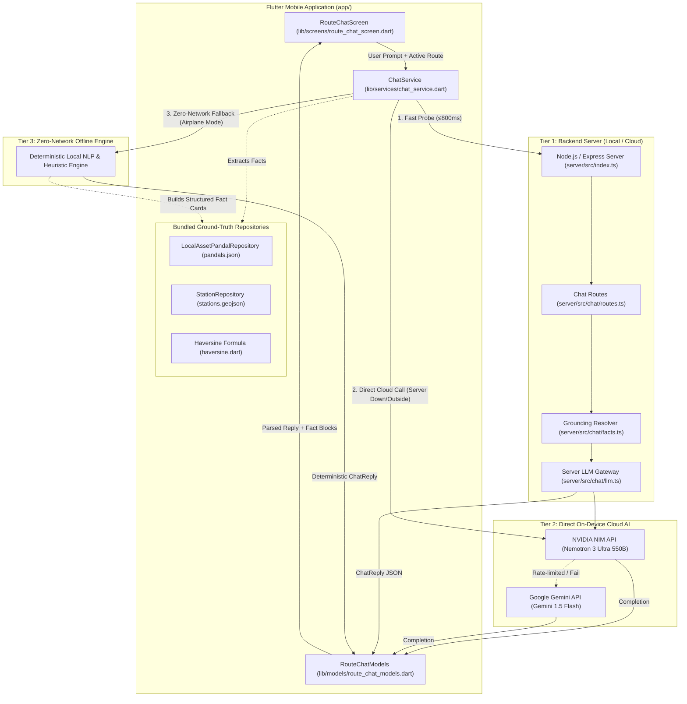

# 🤖 UMA Route Assistant Chatbot — Architecture & Implementation

> **Location:** `docs/architecture/ROUTE_CHATBOT_ARCHITECTURE.md`  
> **Status:** Production-Ready & Deployed  
> **App Version:** Kolkata Puja Parikrama (Uma)  
> **Supported LLMs:** NVIDIA Nemotron 3 Ultra (Primary) · Google Gemini 1.5 Flash (Secondary) · Offline Heuristic Engine (Fallback)

---

## 1. Executive Summary & Design Principles

The **UMA Route Assistant** is an on-device/hybrid AI chatbot designed specifically for Kolkata Durga Puja. It resolves routes, live crowd levels, police road blockages, and nearest metro transit options for pandal hoppers.

### Core Architectural Pillars
1. **100% Uptime & Multi-Tier Resilience**: The chatbot never fails. If the local backend server is down or the user is roaming outside on mobile data (4G/5G), the app directly invokes the cloud AI. If in a dead zone or subway tunnel with zero internet, it seamlessly falls back to the deterministic on-device engine.
2. **Ground Truth Over Hallucination**: Large Language Models often hallucinate specific local metro lines or invent road distances. UMA strictly grounds every query with bundled spatial datasets (`pandals.json`, `stations.geojson`, Haversine formulas) before prompting the LLM.
3. **Card-Based Hybrid UI**: Conversational responses are kept brief (1–2 sentences), while rich structured data (walking duration, barricade notices, crowd levels, station chips) renders as interactive cards directly below the message.

---

## 2. End-to-End System Architecture



---

## 3. The 3-Tier Execution Pipeline

| Tier | Engine / Provider | Trigger Condition | Latency | Capabilities |
| :--- | :--- | :--- | :--- | :--- |
| **Tier 1** | **Backend Server Gateway** (`server/`) | When running local Node server via USB `adb reverse` or cloud endpoint | ~300ms – 1.2s | Live crowd aggregation, traffic crawlers, central rate limiting, cache persistence. |
| **Tier 2** | **Direct Cloud AI Agent** (NVIDIA Nemotron 3 Ultra) | When PC server is unreachable and phone is on 4G/5G or Wi-Fi | ~600ms – 1.8s | High-reasoning multilingual responses in Bengali, Banglish, & English grounded with real facts. |
| **Tier 2.1** | **Secondary Cloud AI** (Google Gemini 1.5 Flash) | If NVIDIA quota is exhausted or times out | ~500ms – 1.5s | Secondary cloud fallback. |
| **Tier 3** | **On-Device Offline Engine** (Local Heuristics) | Airplane mode, underground transit, severe cellular blackout | **< 10ms (Instant)** | Answers greetings, top pandals by zone, crowd timing advisories, nearest metro stations, & emergency helplines. |

---

## 4. Grounding & Fact Extraction Pipeline

Before calling the LLM, the system generates a structured `FACTS JSON` payload from bundled assets:

```
User Query: "হাওড়া থেকে বাগবাজার কীভাবে যাব? (Howrah to Bagbazar best route?)"
                            │
                            ▼
    ┌────────────────────────────────────────────────────────┐
    │          Entity Recognition & Spatial Match            │
    │  • Origin: Howrah Railway Station [22.5839, 88.3426]   │
    │  • Destination: Bagbazar Sarbojanin [22.6026, 88.3664]  │
    │  • Nearest Metro: Shyambazar Metro Station (450m)      │
    │  • Walk Distance: 5.2 km (~65 min)                    │
    │  • Known Alert: Rabindra Sarani police pedestrian zone │
    └────────────────────────────────────────────────────────┘
                            │
                            ▼
    ┌────────────────────────────────────────────────────────┐
    │                 Structured Grounding Prompt            │
    │  [USER QUESTION] ...                                   │
    │  [FACTS JSON] { distance_m: 5200, metro: "Shyambazar" }│
    │  [SYSTEM PROMPT] "Answer in 1-2 warm sentences..."     │
    └────────────────────────────────────────────────────────┘
                            │
                            ▼
                 NVIDIA Nemotron 3 Ultra
                            │
                            ▼
    ┌────────────────────────────────────────────────────────┐
    │               UI Component Generation                  │
    │  1. Text Answer (Conversational Bengali / English)     │
    │  2. RouteBlock (from, to, walk duration, distance)     │
    │  3. StationBlock (Shyambazar Metro · Blue Line)        │
    │  4. Action Buttons (Show on Map, Share with Squad)     │
    └────────────────────────────────────────────────────────┘
```

---

## 5. UI Layer & Structured Card Blocks

The interface decouples conversational text from actionable metrics using polymorphic data blocks defined in `lib/models/route_chat_models.dart`:

1. **`RouteBlock`**: Displays origin, destination, estimated walking duration, distance in km, and active issue count.
2. **`BlockageBlock`**: Highlights official police barricades, one-way pedestrian diversions, and road advisories.
3. **`CrowdBlock`**: Visual crowd density meter (`low`, `moderate`, `high`, `packed`) with live update freshness.
4. **`StationBlock`**: Nearest Metro / Suburban Railway stations with line colors and walking distance in meters.
5. **Interactive Actions**:
   - `show_on_map`: Centers the map on the destination pandal.
   - `start_walking`: Initiates compass-directed walking navigation.
   - `share_with_group`: Shares the route/transit update directly into the squad group chat.

---

## 6. Multilingual & Dialect Support

The system prompt and grounding engine explicitly support Kolkata's three primary communication styles:

| Dialect | Input Example | Chatbot Handling |
| :--- | :--- | :--- |
| **Bengali Script** | `"কলেজ স্কোয়ারে এখন কেমন ভিড়?"` | Responds in polite, natural Bengali with festive Kolkata warmth. |
| **Banglish** | `"Howrah theke Bagbazar kibhabe jabo?"` | Understands colloquial phonetics and replies in natural Banglish/Bengali. |
| **English** | `"Is College Street open for cars tonight?"` | Responds in clear English with exact Kolkata landmarks and police signage guidance. |

---

## 7. Privacy & Security Architecture

- **Zero Personally Identifiable Information (PII)**: No user phone numbers, Google accounts, or device IMEI numbers are ever sent to the LLM or chat server.
- **Anonymous Ephemeral ID**: Uses a random UUID (`anon_<timestamp>_<hex>`) stored locally in `SharedPreferences` purely to enforce abuse and rate limits.
- **Client-Side Sanitization**: User prompt markdown/code fences are sanitized prior to prompt concatenation.

---

## 8. Key Codebase Files

| Component | File Path | Role |
| :--- | :--- | :--- |
| **Client Orchestrator** | `app/lib/services/chat_service.dart` | Multi-tier client orchestrator with direct NVIDIA/Gemini API calls and local fallback. |
| **Chat UI** | `app/lib/screens/route_chat_screen.dart` | Chat UI with speech bubbles, live status header, suggested prompts, and fact cards. |
| **Chat Models** | `app/lib/models/route_chat_models.dart` | Data structures for `ChatReply`, `ChatFactBlock`, `RouteBlock`, `StationBlock`. |
| **App Config** | `app/lib/config/app_config.dart` | Central keys, model definitions, and environment defaults for Nemotron & Gemini. |
| **Server LLM Gateway** | `server/src/chat/llm.ts` | Node.js backend LLM caller with rate limiting and retry logic. |
| **Server Facts Engine** | `server/src/chat/facts.ts` | Server-side spatial fact resolver. |
| **Server Chat Router** | `server/src/chat/routes.ts` | Express/HTTP routes for `/chat` and `/chat/status`. |
| **Unit & Widget Tests** | `app/test/route_chat_service_test.dart`<br/>`app/test/route_chat_screen_test.dart` | Automated test suite verifying serialization, API handling, and offline fallback. |

---

## 9. Development & Verification Commands

### Test Backend LLM Integration
```bash
cd server
node test/test-nemotron-chat.js
```

### Enable USB Reverse Port Forwarding for Mobile Dev
```bash
adb reverse tcp:8080 tcp:8080
```

### Run Flutter Test Suite
```bash
cd app
flutter test test/route_chat_service_test.dart
flutter test test/route_chat_screen_test.dart
```

### Build & Deploy Release APK to Phone
```bash
cd app
flutter build apk --release
adb install -r build/app/outputs/flutter-apk/app-release.apk
```
